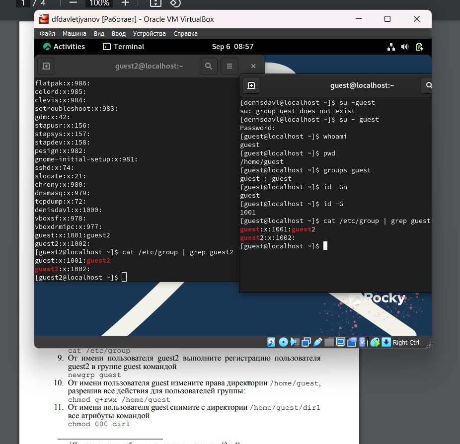

---
## Front matter
lang: ru-RU
title: Лабораторная работа №1
subtitle: Информационная безопасность
author:
  - Давлетьянов Д. Ф.
institute:
  - Российский университет дружбы народов им. Патриса Лумумбы
date: 2024

## i18n babel
babel-lang: russian
babel-otherlangs: english

## Formatting pdf
toc: false
toc-title: Содержание
slide_level: 2
aspectratio: 169
section-titles: true
theme: metropolis
header-includes:
 - \metroset{progressbar=frametitle,sectionpage=progressbar,numbering=fraction}
 - '\makeatletter'
 - '\beamer@ignorenonframefalse'
 - '\makeatother'
---

## Докладчик

:::::::::::::: {.columns align=center}
::: {.column width="70%"}

  * Давлетьянов Денис Фидаритович
  * Студент группы НКАбд-01-22
  * Студ. билет 1032171130
  * Российский университет дружбы народов им. Патриса Лумумбы

:::
::: {.column width="30%"}


:::
::::::::::::::


## Цель лабораторной работы

- Получить практические навыки работы в консоли с атрибутами файлов для групп пользователей

## Теоретическая справка (1)

**Права доступа** определяют, какие действия конкретный пользователь может или не может совершать с определенным файлами и каталогами. С помощью разрешений можно создать надежную среду — такую, в которой никто не может поменять содержимое ваших документов или повредить системные файлы. [1]

## Теоретическая справка (2)

**Группы пользователей Linux** кроме стандартных root и users, здесь есть еще пару десятков групп. Это группы, созданные программами, для управления доступом этих программ к общим ресурсам. Каждая группа разрешает чтение или запись определенного файла или каталога системы, тем самым регулируя полномочия пользователя, а следовательно, и процесса, запущенного от этого пользователя. Здесь можно считать, что пользователь - это одно и то же что процесс, потому что у процесса все полномочия пользователя, от которого он запущен. [2]

# Ход выполнения лабораторной работы

# Атрибуты файлов

## подготовка

В установленной операционной системе создайте учётную запись пользователя guest2 

так как guest уже был создан его не пересоздавали. просто командой useradd создали guest2 и командой passwd задали пароль.
это видно на видео но не скрине.

## задание

Осуществите вход в систему от двух пользователей на двух разных консолях, определите директорию, в которой вы находитесь. Уточните имя вашего пользователя, его группу, кто входит в неё и к каким группам принадлежит он сам. Определите, в какие группы входят пользователи. Сравните вывод команды groups с выводом команд id -Gn и id -G:

командой su - guest, su - guest2 я сумел зайти как гости на разных консолях

{ #fig:002 width=70% height=70% }

## сравнение

Сравните полученную информацию с содержимым файла /etc/group:

{ #fig:003 width=70% height=70% }

## работа с группами 

От имени пользователя guest2 выполните регистрацию пользователя guest2 в группе guest командой newgrp guest
От имени пользователя guest измените права директории /home/guest, разрешив все действия для пользователей группы. 
От имени пользователя guest снимите с директории /home/guest/dir1 все атрибуты.

{ #fig:004 width=70% height=70% }


## Заполните таблицу «Установленные права и разрешённые действия для групп пользователей» (см. табл. 3.1)

|   Права директории   |      Права файла     | Создание файла| Удаление файла | Запись в файл | Чтение файла | Смена директории | Просмотр файлов в директории | Переименование файл | Смена атрибутов файла |
|:---------------------|:---------------------|-----|-----|-----|-----|-----|-----|-----|-----|
|```d--------- (000)```|```---------- (000)```|  -	|  -  |  -  |  -  |  -	|  -  |  -  |  -  |
|```d-----x--- (010)```|```---------- (000)```|  -	|  -  |	 -	|  -  |  +  |  -  |  -  |  +  |
|```d----w---- (020)```|```---------- (000)```|  -	|  -  |	 -  |  -  |  -	|  -  |  -  |  -  |
|```d----wx--- (030)```|```---------- (000)```|  +	|  +  |  -	|  -  |  +  |  -  |  +  |  +  |
|```d---r----- (040)```|```---------- (000)```|  -	|  -  |	 -  |  -  |  -	|  +  |  -  |  -  |

Целиком таблицу можно просмотреть в файле отчета.

## Заполните таблицу «Минимальные права для совершения операций от имени пользователей входящих в группу» (см. табл. 3.2)

|        Операция        | Права на директорию | Права на файл |
|------------------------|---------------------------------|---------------------------|
|     Создание файла     |           ```d----wx--- (030)```      |      ```---------- (000)```     |	    
|     Удаление файла     |           ```d----wx--- (030)```      |      ```---------- (000)```     |
|      Чтение файла      |           ```d-----x--- (010)```      |      ```----r----- (040)```     |
|      Запись в файл     |           ```d-----x--- (010)```      |      ```-----w---- (020)```     |
|  Переименование файла  |           ```d----wx--- (030)```      |      ```---------- (000)```     |
| Создание поддиректории |           ```d----wx--- (030)```      |      ```---------- (000)```     |
| Удаление поддиректории |           ```d----wx--- (030)```      |      ```---------- (000)```     |

## Сравнение

Сравнивая таблицу 3.1. с таблицей 2.1, можно сказать, что они одинаковы. Единственное различие в том, что в предыдущий раз мы присваивали права владельцу, а в этот раз группе.

# Вывод

## Вывод

- Были получены практические навыки работы в консоли с атрибутами файлов для групп пользователей

# Список литературы. Библиография

[0] Методические материалы курса

[1] Права доступа: https://codechick.io/tutorials/unix-linux/unix-linux-permissions

[2] группы опльзователей https://techrocks.ru/2020/01/16/linux-user-groups-explained/