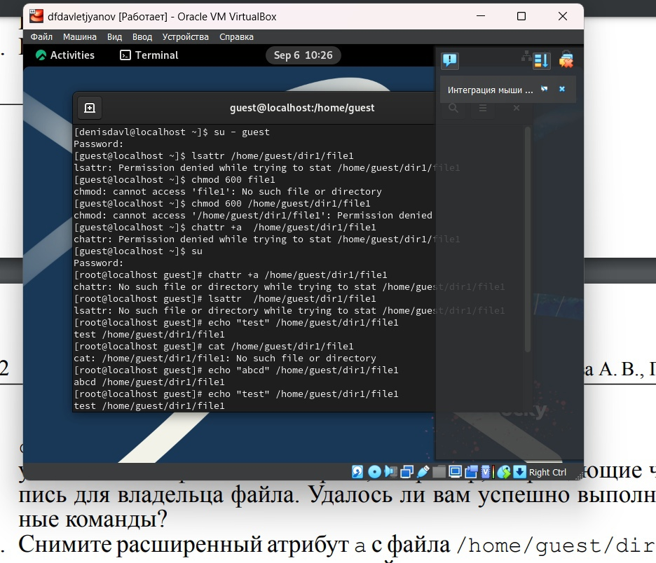
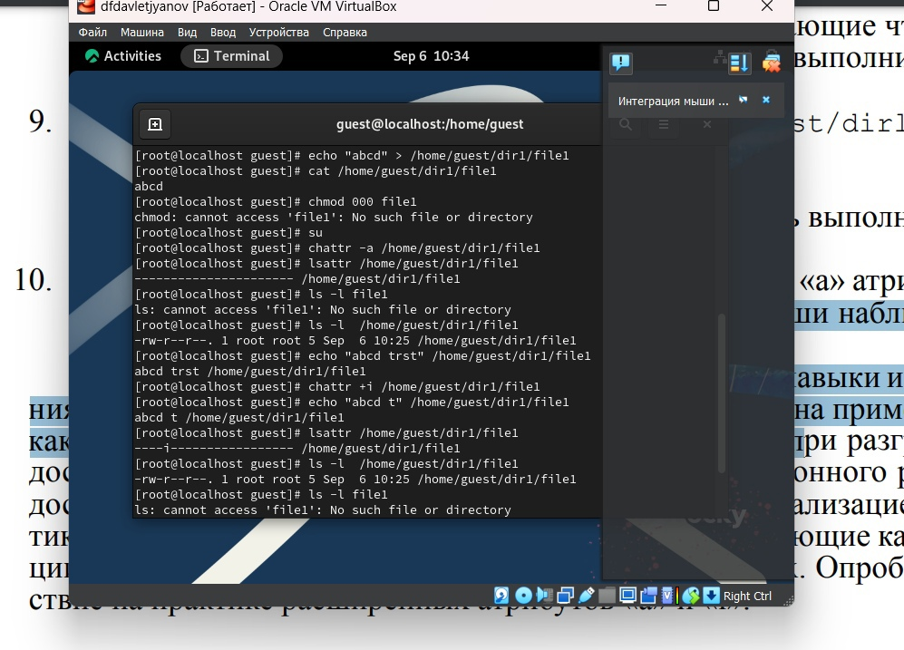
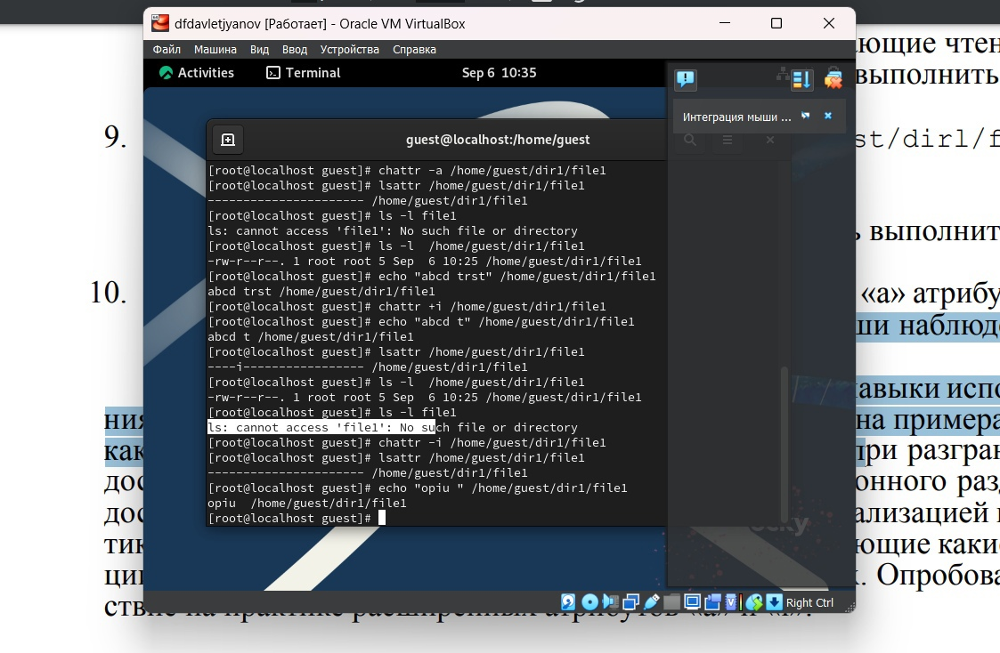

---
## Front matter
lang: ru-RU
title: Лабораторная работа №1
subtitle: Информационная безопасность
author:
  - Давлетьянов Д. Ф.
institute:
  - Российский университет дружбы народов им. Патриса Лумумбы
date: 2024

## i18n babel
babel-lang: russian
babel-otherlangs: english

## Formatting pdf
toc: false
toc-title: Содержание
slide_level: 2
aspectratio: 169
section-titles: true
theme: metropolis
header-includes:
 - \metroset{progressbar=frametitle,sectionpage=progressbar,numbering=fraction}
 - '\makeatletter'
 - '\beamer@ignorenonframefalse'
 - '\makeatother'
---

## Докладчик

:::::::::::::: {.columns align=center}
::: {.column width="70%"}

  * Давлетьянов Денис Фидаритович
  * Студент группы НКАбд-01-22
  * Студ. билет 1032171130
  * Российский университет дружбы народов им. Патриса Лумумбы

:::
::: {.column width="30%"}

:::
::::::::::::::

## Цель лабораторной 

- Получить практические навыки работы в консоли с расширенными атрибутами файлов

## Теоретическая справка (1)

**Права доступа** определяют, какие действия конкретный пользователь может или не может совершать с определенным файлами и каталогами. С помощью разрешений можно создать надежную среду — такую, в которой никто не может поменять содержимое ваших документов или повредить системные файлы. [1]

## Теоретическая справка (2)

**Расширенные атрибуты файлов Linux** представляют собой пары имя:значение, которые постоянно связаны с файлами и каталогами, подобно тому как строки окружения связаны с процессом. Атрибут может быть определён или не определён. Если он определён, то его значение может быть или пустым, или не пустым. [2]

## Виды расширенных атрибутов

- chattr +a # только добавление. Удаление и переименование запрещено;

- chattr +A # не фиксировать данные об обращении к файлу

- chattr +c # сжатый файл

- chattr +d # неархивируемый файл

- chattr +i # неизменяемый файл

- chattr +S # синхронное обновление

- chattr +s # безопасное удаление, (после удаления место на диске переписывается нулями)

- chattr +u # неудаляемый файл

- chattr -R # рекурсия

[3]

# Ход выполнения лабораторной работы

## 1-6 пункты задания лабораторной 

Определили расширенные атрибуты файла, установили права, разрешающие чтение и запись для владельца файла, попробовали установиться расширенный атрибут а и получили отказ.
Зашли на консоль с правами администратора и атрибут установился.

{ #fig:001 width=70% height=70% }

Выполнили дозапись в файл file1 слова «test».
После этого выполните чтение файла file1 и убедились, что слово test было успешно записано в file1.

## 7-9 пункт задания лабораторной

Попробовали стереть в файле имеющуюся в нём информацию, а также переименовать файл.

Попробовали установить на файл file1 права, например, запрещающие чтение и запись для владельца файла. 

Этого сделать не удалось.

Сняли расширенный атрибут a с файла от имени суперпользователя командой.
Повторили операции, которые ранее не удавалось выполнить. 

Теперь все операции выполняются.

{ #fig:001 width=70% height=70% }

## 10 пункт задания лабораторной

Псоле всего сделаного ранее теперь повторяю действия по шагам, заменив атрибут «a» атрибутом «i».
Дозаписать информацию в файл  удалось.

{ #fig:001 width=70% height=70% }

# Вывод

## Вывод

- Были получены практические навыки работы в консоли с расширенными атрибутами файлов

# Список литературы. Библиография

[0] Методические материалы курса

[1] Права доступа: https://codechick.io/tutorials/unix-linux/unix-linux-permissions

[2] Расширенные атрибуты: https://ru.manpages.org/xattr/7

[3] Операции с расширенными атрибутами: https://p-n-z-8-8.livejournal.com/64493.html