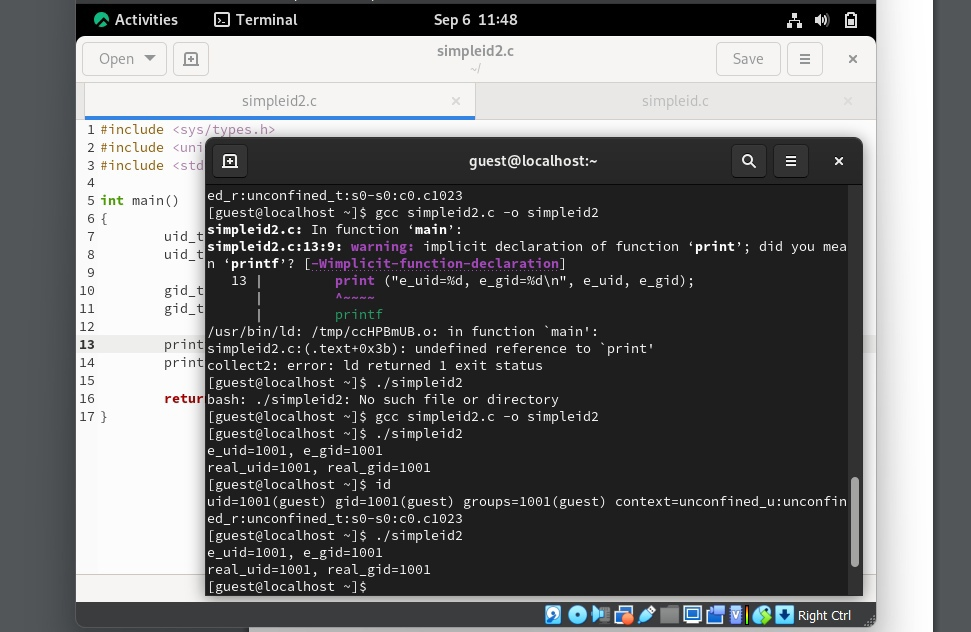

---
## Front matter
lang: ru-RU
title: Лабораторная работа №1
subtitle: Информационная безопасность
author:
  - Давлетьянов Д. Ф.
institute:
  - Российский университет дружбы народов им. Патриса Лумумбы
date: 2024

## i18n babel
babel-lang: russian
babel-otherlangs: english

## Formatting pdf
toc: false
toc-title: Содержание
slide_level: 2
aspectratio: 169
section-titles: true
theme: metropolis
header-includes:
 - \metroset{progressbar=frametitle,sectionpage=progressbar,numbering=fraction}
 - '\makeatletter'
 - '\beamer@ignorenonframefalse'
 - '\makeatother'
---

## Докладчик

:::::::::::::: {.columns align=center}
::: {.column width="70%"}

  * Давлетьянов Денис Фидаритович
  * Студент группы НКАбд-01-22
  * Студ. билет 1032171130
  * Российский университет дружбы народов им. Патриса Лумумбы

:::
::: {.column width="30%"}

:::
::::::::::::::

## Цель лабораторной работы

- Изучение механизмов изменения идентификаторов, применения
SetUID- и Sticky-битов. Получение практических навыков работы в консоли с дополнительными атрибутами. Рассмотрение работы механизма смены идентификатора процессов пользователей, а также влияние бита Sticky на запись и удаление файлов

## Теоретическая справка (1)

**1. Дополнительные атрибуты файлов Linux** 

В Linux существует три основных вида прав — право на чтение (read), запись (write) и выполнение (execute), а также три категории пользователей, к которым они могут применяться — владелец файла (user), группа владельца (group) и все остальные (others). Но, кроме прав чтения, выполнения и записи, есть еще три дополнительных атрибута. [1]

## Теоретическая справка (2)

**2. Компилятор GCC** 

GСС - это свободно доступный оптимизирующий компилятор для языков C, C++.
Собственно программа gcc это некоторая надстройка над группой компиляторов, которая способна анализировать имена файлов, передаваемые ей в качестве аргументов, и определять, какие действия необходимо выполнить. Файлы с расширением .cc или .C рассматриваются, как файлы на языке C++, файлы с расширением .c как программы на языке C, а файлы c расширением .o считаются объектными. [2]

# Ход выполнения лабораторной работы

## 5.2.1. Подготовка лабораторного стенда
проверили командой gcc -v наличие нужного софта для работы
также понизил уровень защиты командой setenforce 0 до следующего запуска виртуальной машины

{ #fig:001 width=70% height=70% }

## 5.3.1 Создание программы

Вначале вхожу как гость guest
Создал программу simpleid.c  с помощью touch, далее нашел его в файлах для более комфортного написания программы в ней.

{ #fig:001 width=70% height=70% }

## 5.3.1 Создание программы

Скомплилировали и выполнили программу simpleid которая выдала нам два значения. Затем выполнили системную программу id и сравнили полученные результаты
Получили что данные точны.

{ #fig:001 width=70% height=70% }

## 5.3.1 Создание программы

Переписал программу полностью так как нужны были реальные идентификаторы.

{ #fig:001 width=70% height=70% }

Скомплилировали и выполнили программу simpleid2

## 5.3.1 Создание программы

От имени суперпользователя выполнили команды и проверили правильность установки новых атрибутов и смены
владельца файла. Запустили simpleid2 и id.
Сравнили результаты. Проделали то же самое относительно SetGID-бита

{ #fig:001 width=70% height=70% }

{ #fig:001 width=70% height=70% }

## 5.3.1 Создание программы

Скомплилировали программу readfile.c

## 5.3.1 Создание программы

Сменили владельца у файла и изменили права так, чтобы только суперпользователь мог прочитать его, a guest не мог

## 5.3.1 Создание программы

Проверили, что guest не может прочитать файл.
Сменили у программы readfile владельца и установили SetU’D-бит. Проверили, может ли программа readfile прочитать файл readfile.c, файл /etc/shadow

## 5.3.1 Создание программы

От имени суперпользователя все предыдущие команды удается выполнить

## 5.3.2. Исследование Sticky-бита

Выяснили, установлен ли атрибут Sticky на директории /tmp,
создали файл file01.txt со словом test.
Просмотрели атрибуты у только что созданного файла и разрешили чтение и запись для категории пользователей «все остальные»

## 5.3.2. Исследование Sticky-бита

От guest2 попробовали прочесть файл, дозаписать слово test2, затем записать слово test3, стерев при этом всю имеющуюся в файле информацию. Попробовали удалить файл. Этого сделать не удалось.

Повысили свои права до суперпользователя и сняли атрибут t с директории /tmp. От guest2 проверили, что атрибута t у директории /tmp нет

## 5.3.2. Исследование Sticky-бита

Повторили предыдущие шаги. При повторении всё получилось.
Удалось удалить файл от имени пользователя, не являющегося его владельцем.

Повысили свои права до суперпользователя и вернули атрибут t на директорию /tmp

# Вывод

## Вывод

- Были изучены механизмы изменения идентификаторов и применения SetUID- и Sticky-битов. Получены практические навыки работы в консоли с дополнительными атрибутами. Были рассмотрены работа механизма смены идентификатора процессов пользователей, а также влияние бита Sticky на запись и удаление файлов

# Список литературы. Библиография

[0] Методические материалы курса

[1] Дополнительные атрибуты: https://tokmakov.msk.ru/blog/item/141

[2] Компилятор GSS: http://parallel.imm.uran.ru/freesoft/make/instrum.html